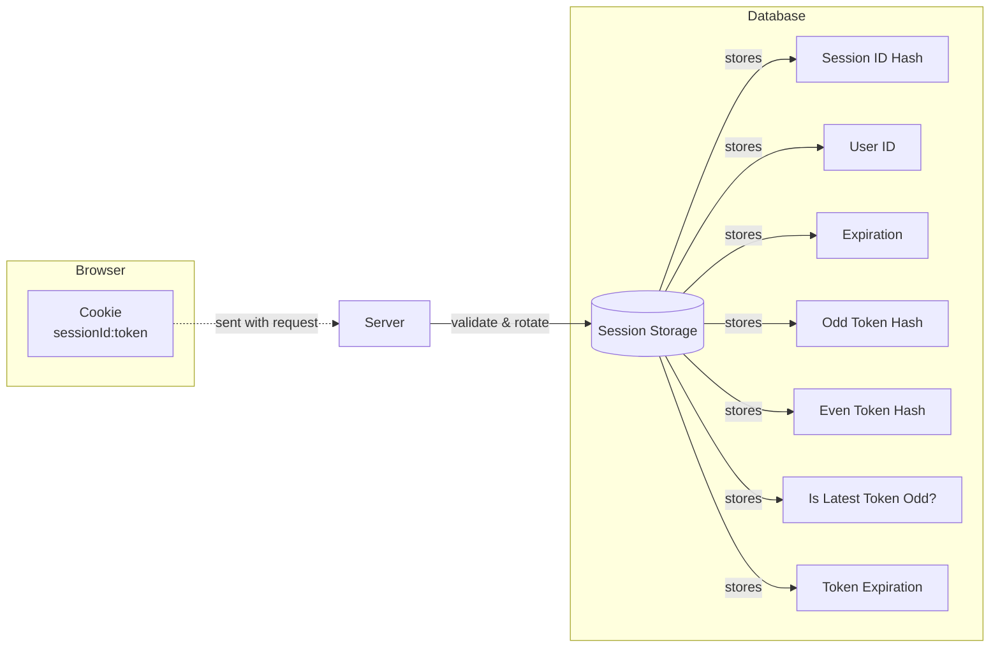
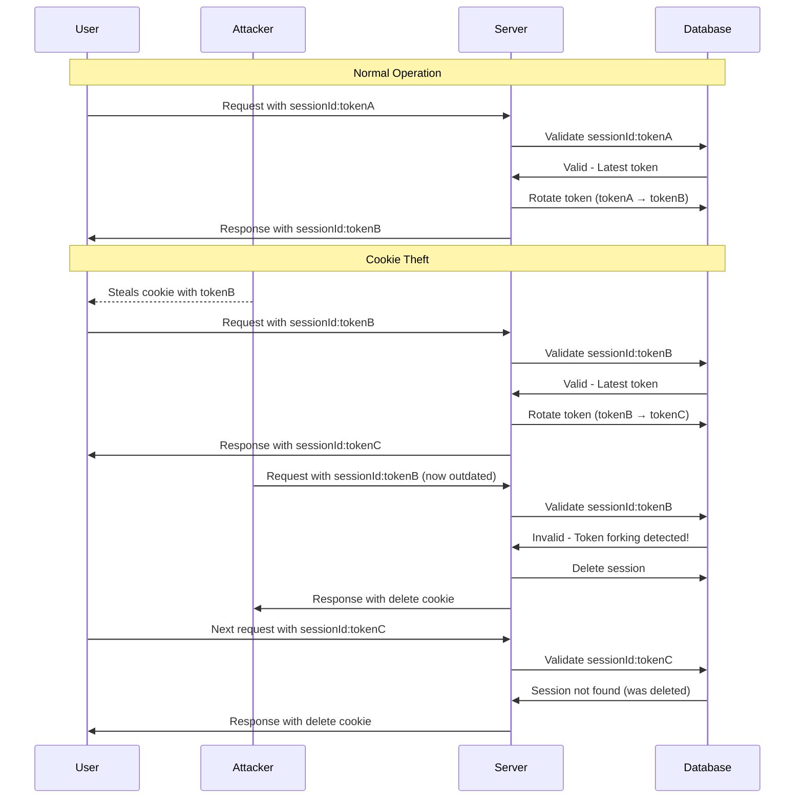
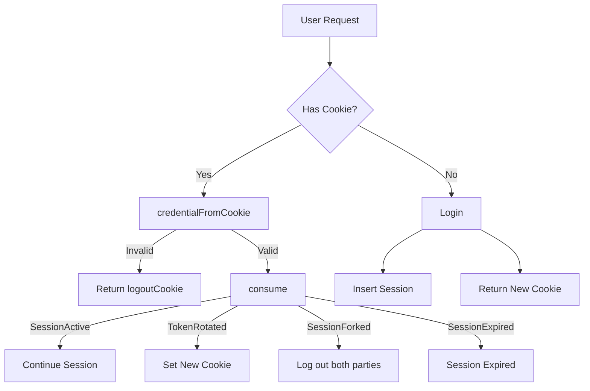

# tiny-cookie-session

**tiny-cookie-session** is a cookie-based session management library that detects session forking.
When session forking is detected, this library logs out both the attacker and the legitimate user.

## How It Works



## Important: Security limitations

While this library detects session forking, it does not provide complete protection.
You need to understand its limitations before using it in production.

### How session id and token are stored

This library uses randomly generated session id and token to identify a session.
The session id is a long-lived identifier for the session,
while the token is a short-lived value that is rotated periodically.
The session id and token are stored in a cookie in a format like this: `${sessionId}:${token}`.

We also store the session id and two latest tokens (hashes) in the database.
These two tokens are what are currently considered valid tokens for the session.
We store two tokens instead of one to handle a race condition, where the user makes two requests
at the same time and either request could rotate the token.

While the two latest tokens are considered valid,
only the latest one can be used to rotate the token.

### Session Forking Detection Process



### Detecting outdated cookies

After a cookie is stolen and the token is rotated twice,
either the attacker or the legitimate user will have an outdated token.
When this outdated token is used, we will detect this as session forking and log out both parties.
We log out both parties because we cannot determine which party used the invalid token.

It doesn't have to be the actual outdated token to be detected as session forking.
As long as it's paired with a valid session id, any token value,
even ones that were never issued, will be detected as session forking.
This means theoretically, if the attacker can guess a valid session id,
they can use any random token value to log out the legitimate user.
But practically this is not a concern because we use 256 bits of entropy for session id generation,
making it unguessable.

### Attack Scenarios and Outcomes

| Scenario | Detection Possible? | Outcome |
|----------|---------------------|---------|
| Attacker steals old cookie (token rotated twice since) | Yes | Both parties logged out when attacker uses the cookie |
| Attacker steals recent cookie | Yes, after conditions are met | Attacker can use cookie until session forking is detected |
| Attacker steals cookie, legitimate user never uses session again | No | Attacker can use cookie until session expires |
| Attacker steals cookie, logs out legitimate user | No | Attacker maintains access until session expires |
| Persistent cookie theft (e.g., malware) | No | Cannot be prevented by cookie-based mechanisms |

### If the attacker steals an old cookie

If the attacker steals a cookie and the user has already rotated the token twice since then,
both parties will be logged out when the attacker uses the cookie.
In this case, no harm is done to the legitimate user, except the user will be logged out 
unexpectedly.

### If the attacker steals a recent cookie

If the attacker steals a cookie, and the user has not rotated the token twice since then,
the attacker can use the cookie until this library detects it as session forking.

For this library to detect session forking, two conditions must be met after the cookie is stolen:

1. The token must be rotated at least twice.
2. A party with outdated token must make a request after that.

The token rotation in condition one can be achieved by any combination of the user and the attacker
making requests: (user, user), (user, attacker), (attacker, user), or (attacker, attacker).
Until these two conditions are met, the attacker can use the stolen cookie.

This means there are two worst-case scenarios where we can't detect session forking:

1. The attacker steals a cookie, and the legitimate user never uses the session again (inactive).
2. The attacker steals a cookie, and logs out the legitimate user.

We can't detect session forking in these scenarios, and it cannot be solved unless the user has 
some way to prove their identity, like how it's done in Device Bound Session Credentials (DBSC).

The best we can do is to set a short session expiration time (`sessionExpiresIn`),
and also show a "Log out other devices" screen every time the user logs in.
Setting a short session expiration time will limit the window of opportunity for the attacker,
but it will also inconvenience legitimate users by requiring them to log in more frequently.

One way to make it safer is by restricting users to have only one active session at a time.
As opposed to manually logging out other devices, this will automatically log out
other devices when the user logs in from a new device, requiring one less human interaction.

Another way is to implement "Don't remember me" functionality,
which deletes the cookie when the browser is closed.
This can be done easily by removing the `Expires` and `Max-Age` attributes from the session cookie.

### Persistent cookie theft

If the cookie is stolen repeatedly (e.g., via persistent background malware),
it can't be prevented by any cookie-based mechanism, including this library or even DBSC.

The user is cooked at this point.
The only solution is to log in from a clean device and log out all other devices.

## Library API Flow



## Installation

```sh
pnpm install github:aabccd021/tiny-cookie-session
yarn add github:aabccd021/tiny-cookie-session
bun install github:aabccd021/tiny-cookie-session
```

## Example usage with Bun

```ts
import * as sqlite from "bun:sqlite";
import * as tcs from "tiny-cookie-session";

function serializeCookie(cookie: tcs.Cookie): string {
  return new Bun.Cookie("mysession", cookie.value, cookie.options).serialize();
}

function parseCookie(request: Request): string | undefined {
  const cookieHeader = request.headers.get("Cookie");
  if (cookieHeader === null) return undefined;

  const sessionCookie = new Bun.CookieMap(cookieHeader).get("mysession");
  if (sessionCookie === null) return undefined;

  return sessionCookie;
}

const db = new sqlite.Database(":memory:");

db.run(`
  CREATE TABLE session (
    id_hash TEXT PRIMARY KEY,
    user_id TEXT NOT NULL,
    exp TEXT NOT NULL,
    odd_token_hash TEXT NOT NULL,
    even_token_hash TEXT,
    token_exp TEXT NOT NULL,
    is_latest_token_odd INTEGER NOT NULL,
    CHECK (is_latest_token_odd IN (0, 1))
  )
`);

function dbSelect(idHash: string) {
  const row: any = db
    .query(
      `
      SELECT user_id, exp, token_exp, odd_token_hash, even_token_hash, is_latest_token_odd
      FROM session WHERE id_hash = :id_hash
    `,
    )
    .get({ id_hash: idHash });

  if (row === null) {
    return null;
  }

  return {
    userId: row.user_id,
    exp: new Date(row.exp),
    tokenExp: new Date(row.token_exp),
    oddTokenHash: row.odd_token_hash,
    evenTokenHash: row.even_token_hash,
    isLatestTokenOdd: row.is_latest_token_odd === 1,
  };
}

function dbInsert(action: tcs.InsertAction, userId: string) {
  db.query(
    `
    INSERT INTO session (id_hash, user_id, exp, odd_token_hash, token_exp, is_latest_token_odd)
    VALUES (:id_hash, :user_id, :exp, :odd_token_hash, :token_exp, :is_latest_token_odd)
  `,
  ).run({
    id_hash: action.idHash,
    user_id: userId,
    exp: action.exp.toISOString(),
    odd_token_hash: action.oddTokenHash,
    token_exp: action.tokenExp.toISOString(),
    is_latest_token_odd: action.isLatestTokenOdd ? 1 : 0,
  });
}

function dbUpdate(action: tcs.UpdateAction) {
  db.query(
    `
    UPDATE session
    SET 
      exp = :exp,
      token_exp = :token_exp,
      odd_token_hash = COALESCE(:odd_token_hash, odd_token_hash),
      even_token_hash = COALESCE(:even_token_hash, even_token_hash),
      is_latest_token_odd = :is_latest_token_odd
    WHERE id_hash = :id_hash
  `,
  ).run({
    id_hash: action.idHash,
    exp: action.exp.toISOString(),
    token_exp: action.tokenExp.toISOString(),
    odd_token_hash: action.oddTokenHash ?? null,
    even_token_hash: action.evenTokenHash ?? null,
    is_latest_token_odd: action.isLatestTokenOdd ? 1 : 0,
  });
}

function dbDelete(action: tcs.DeleteAction) {
  db.query("DELETE FROM session WHERE id_hash = :id_hash").run({ id_hash: action.idHash });
}

async function login(request: Request) {
  const body = await request.formData();

  // User ID should be obtained from a trusted source.
  const userId = body.get("user_id")?.toString();
  if (userId === undefined || userId === "") {
    return new Response("No User ID");
  }

  const { action, cookie } = await tcs.login();

  if (action.type === "insert") {
    dbInsert(action, userId);
  } else {
    action.type satisfies never;
  }

  return new Response("Logged in", {
    headers: { "Set-Cookie": serializeCookie(cookie) },
  });
}

async function logout(request: Request) {
  const sessionCookie = parseCookie(request);
  if (sessionCookie === undefined) {
    return new Response("No Session Cookie", {
      headers: { "Set-Cookie": serializeCookie(tcs.logoutCookie) },
    });
  }

  const credential = await tcs.credentialFromCookie({ cookie: sessionCookie });
  if (credential === undefined) {
    return new Response("Malformed Session Cookie", {
      headers: { "Set-Cookie": serializeCookie(tcs.logoutCookie) },
    });
  }

  const { action, cookie } = await tcs.logout({ credential });

  if (action.type === "delete") {
    dbDelete(action);
  } else {
    action.type satisfies never;
  }

  return new Response("Logged out", {
    headers: { "Set-Cookie": serializeCookie(cookie) },
  });
}

async function getUserId(request: Request) {
  const sessionCookie = parseCookie(request);
  if (sessionCookie === undefined) {
    return new Response("No Session Cookie");
  }

  const credential = await tcs.credentialFromCookie({ cookie: sessionCookie });
  if (credential === undefined) {
    return new Response("Malformed Session Cookie", {
      headers: { "Set-Cookie": serializeCookie(tcs.logoutCookie) },
    });
  }

  const session = dbSelect(credential.idHash);
  if (session === null) {
    return new Response("Session Not Found", {
      headers: { "Set-Cookie": serializeCookie(tcs.logoutCookie) },
    });
  }

  const { action, cookie, state } = await tcs.consume({ credential, session });

  if (action?.type === "delete") {
    dbDelete(action);
  } else if (action?.type === "update") {
    dbUpdate(action);
  } else if (action !== undefined) {
    action satisfies never;
  }

  const headers = new Headers();
  if (cookie !== undefined) {
    headers.set("Set-Cookie", serializeCookie(cookie));
  }

  if (state === "SessionActive" || state === "TokenRotated") {
    return new Response(`UserId: ${session.userId}`, { headers });
  }

  if (state === "SessionForked" || state === "SessionExpired") {
    return new Response("", { headers });
  }

  state satisfies never;
  throw new Error("Unreachable");
}

Bun.serve({
  fetch: (request) => {
    const url = new URL(request.url);
    if (url.pathname === "/login" && request.method === "POST") return login(request);
    if (url.pathname === "/logout" && request.method === "POST") return logout(request);
    if (url.pathname === "/user_id" && request.method === "GET") return getUserId(request);
    return new Response("Not Found", { status: 404 });
  },
});
```

## Updating Session

When updating a session, you need to be careful not to remove existing tokens.

The library might return `undefined` for either `oddTokenHash` or `evenTokenHash` in the
`UpdateAction`, which means you should not update that column, not set it to `NULL`.

When done naively in a SQL query, you might accidentally set the `even_token_hash` to `NULL`:

```sql
UPDATE session
SET
  odd_token_hash = :odd_token_hash,
  even_token_hash = :even_token_hash
```

Instead, you should use `COALESCE` to only update the column when the value is not `NULL`:

```sql
UPDATE session
SET
  odd_token_hash = COALESCE(:odd_token_hash, odd_token_hash),
  even_token_hash = COALESCE(:even_token_hash, even_token_hash)
```

The same applies to in-memory storage as shown in the [test](./index.test.js).

```ts
if (action.oddTokenHash !== undefined) {
  session.oddTokenHash = action.oddTokenHash;
}
if (action.evenTokenHash !== undefined) {
  session.evenTokenHash = action.evenTokenHash;
}
```

## Log out on malformed cookie or session not found

As shown in the example above, you can use `tcs.logoutCookie` to log out the user when the cookie
is malformed or the session is not found.

Not implementing this will not cause any security issues, but it will leave stale cookies in
the user's browser.

```ts
const credential = await tcs.credentialFromCookie({ cookie: sessionCookie });
if (credential === undefined) {
  return new Response("Malformed Session Cookie", {
    headers: { "Set-Cookie": serializeCookie(tcs.logoutCookie) },
  });
}

const session = dbSelect(credential.idHash);
if (session === null) {
  return new Response("Session Not Found", {
    headers: { "Set-Cookie": serializeCookie(tcs.logoutCookie) },
  });
}
```

## Garbage collection of expired sessions

Since this library doesn't automatically delete expired sessions for inactive users,
you'll need to implement your own garbage collection mechanism:

```js
// Run this periodically
db.query("DELETE FROM session WHERE exp < :now").run({ now: Date.now() });
```

Doing or not doing garbage collection on expired sessions is always safe and has no security
implications, since those sessions would be rejected as "SessionExpired" anyway if a user tried
to use them.

## Force logout session

This library allows you to immediately invalidate sessions by deleting them from the storage
backend.

Unlike JWT, the session logout is effective immediately when this is done.

```js
// Force logout a specific session
db.query("DELETE FROM session WHERE id_hash = :idHash").run({ idHash });

// Force logout all sessions for a specific user
db.query("DELETE FROM session WHERE user_id = :userId").run({ userId });

// Force logout all users
db.query(`DELETE FROM session`).run();
```

## Configuration Options

| Option | Default | Description |
|--------|---------|-------------|
| `sessionExpiresIn` | 24 hours | How long a session can remain active without user interaction |
| `tokenExpiresIn` | 2 minutes | How frequently tokens are rotated when sessions are active |
| `Path` | not set | Cookie path attribute (you should set to `/` for most apps) |
| `SameSite` | `Strict` | Cookie SameSite attribute (you may want `Lax`) |

## Path and SameSite attributes

This library sets `SameSite=Strict` and does not set `Path` by default.

This is the strictest setting for a cookie, which is a good default for a library.

But practically, you usually want `Path=/` and `SameSite=Lax` for session cookies.

To do that, you can override the default options returned by this library:

```ts
import * as tcs from "tiny-cookie-session";

function serializeCookie(cookie: tcs.Cookie): string {
  const options = { ...cookie.options, path: "/", sameSite: "lax" };
  return new Bun.Cookie("mysession", cookie.value, options).serialize();
}
```

## Serializing and Parsing Cookies

This library does not handle cookie serialization and parsing.

You need to do it outside this library, by using your web framework's built-in functionality
or a third-party library.

If you use [Bun Cookie](https://bun.sh/docs/api/cookie) or
[cookie](https://www.npmjs.com/package/cookie),
you can directly use `value` and `options` as arguments to serialize the cookie.

```ts
import * as tcs from "tiny-cookie-session";
import * as cookieLib from "cookie";

const { cookie } = await tcs.login();

new Bun.Cookie("mysession", cookie.value, cookie.options).serialize();

cookieLib.serialize("mysession", cookie.value, cookie.options);
```

## Cookie Signing

The main benefit of signed cookies is being able to detect tampered cookies without
reaching the storage backend, but this isn't strictly required for this library to work or to
provide security.

You can implement cookie signing outside this library as an additional security layer.

```ts
import * as tcs from "tiny-cookie-session";

// Dummy implementations, replace with real signing logic from a library
function signCookie(value: string): string {
  return value;
}
function unsignCookie(signedValue: string): string {
  return signedValue;
}

function serializeAndSignCookie(cookie: tcs.Cookie): string {
  const signedValue = signCookie(cookie.value);
  return new Bun.Cookie("mysession", signedValue, cookie.options).serialize();
}

function parseAndUnsignCookie(request: Request): string | undefined {
  const cookieHeader = request.headers.get("Cookie");
  if (cookieHeader === null) return undefined;

  const sessionCookie = new Bun.CookieMap(cookieHeader).get("mysession");
  if (sessionCookie === null) return undefined;

  return unsignCookie(sessionCookie);
}
```

## Configuring Expiration Times

You can use custom expiration times by passing configuration options to the functions:

```ts
import * as tcs from "tiny-cookie-session";

const config = {
  sessionExpiresIn: 5 * 60 * 60 * 1000, // 5 hours
  tokenExpiresIn: 10 * 60 * 1000, // 10 minutes
};

tcs.consume({ config /* other params */ });

tcs.login({ config });
```

### Session Expiration Time

The `sessionExpiresIn` value controls how long a session can remain active without user interaction,
often referred to as "log out after X minutes of inactivity."

For example, with `sessionExpiresIn: 30 * 60 * 1000` (30 minutes),
a user can remain logged in indefinitely by making requests at least every 29 minutes.

When the user makes a request before the session expires,
the session's expiration time will be extended both in the database's `exp` column and
in the cookie's `Expires` attribute.

Your choice for session expiration time should balance security and user experience.

### Token Expiration Time

The `tokenExpiresIn` value controls how frequently tokens are rotated when sessions are active.

When a token expires but the session is still valid, the system generates a new token.

Set to 2 minutes by default.

The longer you set `tokenExpiresIn`,
the longer an attacker can use a stolen token before session forking is detected.

So you should set this to a value as short as possible,
but still longer than the longest HTTP request time your users might experience.

For example, if your app might need to upload a large file in a single request,
and that upload could take up to 3 minutes on a slow connection,
you should set `tokenExpiresIn` to 3 minutes.

The only reason we don't rotate the token on every request is to handle a race condition
where the user makes two requests at the same time.

### Different Expiration Times per User

You can implement different expiration times for different users by passing custom configuration
to each function call.

```ts
import * as tcs from "tiny-cookie-session";

async function handleRequest(request: Request, securityType: "strict" | "lenient") {
  const config =
    securityType === "strict"
      ? {
          sessionExpiresIn: 30 * 60 * 1000, // 30 minutes
          tokenExpiresIn: 2 * 60 * 1000, // 2 minutes
        }
      : {
          sessionExpiresIn: 24 * 60 * 60 * 1000, // 24 hours
          tokenExpiresIn: 10 * 60 * 1000, // 10 minutes
        };

  await tcs.consume({ config /* other params */ });
}
```

## Session Id and Token Security

This library uses 256 bits of entropy for session id and token generation,
exceeding industry recommendations:

- OWASP recommends at least 64 bits of entropy ([OWASP Guidelines](https://owasp.org/www-community/vulnerabilities/Insufficient_Session-ID_Length))
- Remix uses 64 bits of entropy ([Remix Source](https://github.com/remix-run/remix/blob/b7d280140b27507530bcd66f7b30abe3e9d76436/packages/remix-node/sessions/fileStorage.ts#L45))
- Lucia uses 160 bits of entropy in their example ([Lucia Source](https://github.com/lucia-auth/lucia/blob/46b164f78dc7983d7a4c3fb184505a01a4939efd/pages/sessions/basic-api/sqlite.md?plain=1#L88))
- Auth.js uses 256 bits of entropy in their tests ([Auth.js Source](https://github.com/nextauthjs/next-auth/blob/c5a70d383bb97b39f8edbbaf69c4c7620246e9a4/packages/core/test/actions/session.test.ts#L146))

Since the session id and token are already random strings with high entropy
(unlike a password), we don't need additional processing like salting or peppering.

The session id and token are hashed using SHA-256 before being stored in the database.
This way a database leak would not lead to session hijacking.

Hashing the id and token on every request might seem expensive,
but it's no more demanding than cookie signing, which is a common practice in web services.

Also, [we don't have to use `crypto.timingSafeEqual` when comparing tokens because we are comparing
hashes of high entropy values](https://security.stackexchange.com/questions/237116/using-timingsafeequal#comment521092_237133).

## CSRF

This library focuses solely on session management and does not implement CSRF protection.
You should implement CSRF protection for your entire application before using any functions from
this library.

## LICENSE

```
Zero-Clause BSD
=============

Permission to use, copy, modify, and/or distribute this software for
any purpose with or without fee is hereby granted.

THE SOFTWARE IS PROVIDED "AS IS" AND THE AUTHOR DISCLAIMS ALL
WARRANTIES WITH REGARD TO THIS SOFTWARE INCLUDING ALL IMPLIED WARRANTIES
OF MERCHANTABILITY AND FITNESS. IN NO EVENT SHALL THE AUTHOR BE LIABLE
FOR ANY SPECIAL, DIRECT, INDIRECT, OR CONSEQUENTIAL DAMAGES OR ANY
DAMAGES WHATSOEVER RESULTING FROM LOSS OF USE, DATA OR PROFITS, WHETHER IN
AN ACTION OF CONTRACT, NEGLIGENCE OR OTHER TORTIOUS ACTION, ARISING OUT
OF OR IN CONNECTION WITH THE USE OR PERFORMANCE OF THIS SOFTWARE.
```
